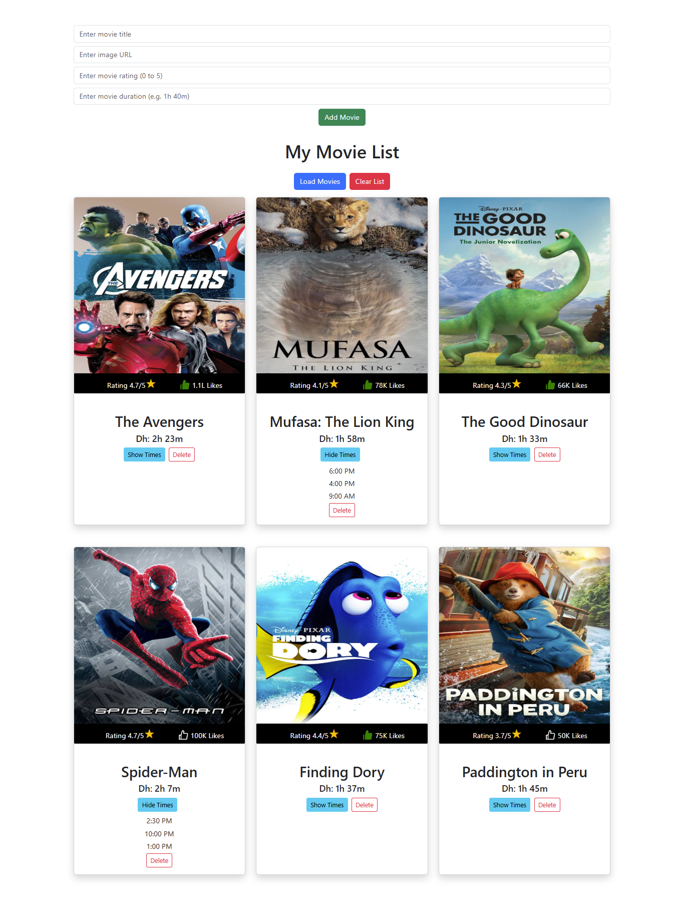
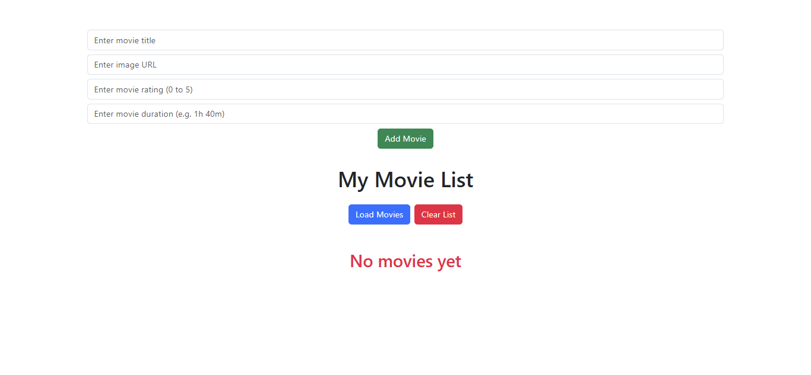

# 🎬 MovieList React App

A simple and interactive Movie List app built with React that allows users to add, like, view showtimes, and delete movies. It uses `localStorage` for data persistence and supports dynamic user interaction with a responsive design.

## 📌 Features

- ✅ Add movies with title, image, rating, and duration.
- 👍 Like/unlike movies with a dynamic like counter.
- ⏰ View random showtimes for each movie.
- 🗑️ Delete movies from the list.
- 💾 Local storage support to persist movie data.
- 🔁 Load predefined sample movies.
- 🧹 Clear the full list with one click.
- 🎨 Responsive card layout using Bootstrap.
- ⭐ Format large like numbers in K and L notation.

## 🛠 Tech Stack

- React
- JavaScript (ES6+)
- Bootstrap 5
- React Icons
- LocalStorage API

## 📦 Installation

1. **Clone the repository**

   ```bash
   git clone https://github.com/your-username/movie-list-app.git
   cd movie-list-app
   ```

📁 File Structure

movie-list-app/
├── public/

├── src/

│   ├── components/

│   │   └── MovieList.jsx

│   ├── MovieList.css

│   ├── App.jsx

│   └── index.js

├── package.json

└── README.md

    Install dependencies

bash
Copy
Edit
npm install
Start the app

bash
Copy
Edit
npm start
The app will run at http://localhost:3000

📸 Screenshots
### 🏠Home Page  


### Adding Movie 


### Clear Page



# Author

## Halimunnisa Shaik

GitHub: https://github.com/Halimunnisa0127

LinkedIn: https://www.linkedin.com/in/halimunnisa-shaik---

