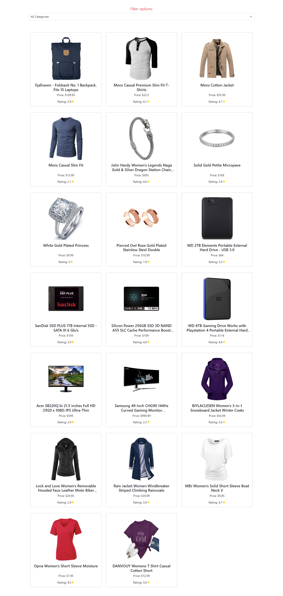
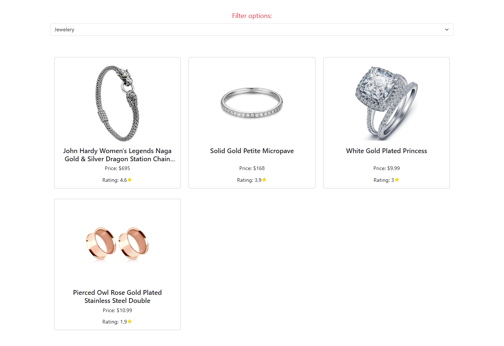

# 🛍️ Product Filter App

This is a simple React application that fetches products from the [Fake Store API](https://fakestoreapi.com/) and allows users to filter them by category.

## 🚀 Features

- Fetches product data using **Axios**
- Filters products based on selected category
- Displays product **image, title, price, and rating**
- Responsive layout using **Bootstrap**

## 🛠️ Technologies Used

- React.js
- Axios
- Bootstrap 5
- JavaScript (ES6)

## 📸 Preview


Home.jsx 
()

## 🧾 How to Run

1. Clone the repository:

```bash
git clone https://github.com/yourusername/product-filter-app.git
```

### Install dependencies:
npm install

Start the development server:

npm start
Open your browser and go to http://localhost:3000

📂 File Structure

src/


├── Home.jsx         # Main component with product

logic

├── App.js           # Root component

├── index.js         # Entry point

└── ...


📦 API Source

https://fakestoreapi.com/products


## **👩‍💻 Author**


# **Halimunnisa Shaik**