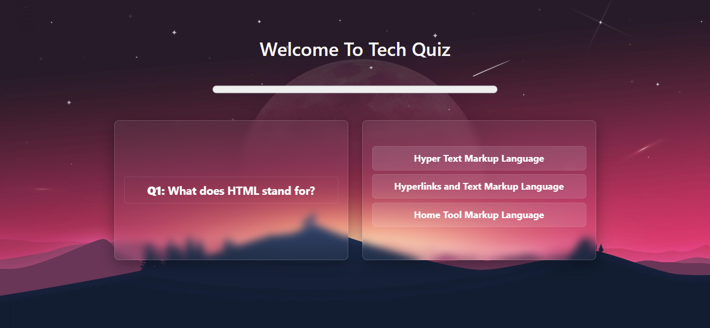
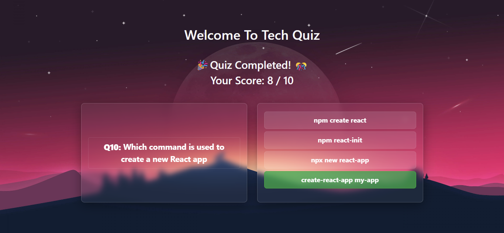

# 🧠 Tech Quiz App (JioHome)

A simple and interactive React-based tech quiz application designed to test your knowledge on HTML, CSS, JavaScript, and React concepts. Built with React functional components and styled using external CSS.

---

## 📸 Preview

> 🚀 Visit the app or run locally to see a 10-question multiple choice quiz with instant feedback, score tracking, and animated progress bar.

---

## 🚀 Features

- ✅ 10 Tech-based MCQ Questions
- 🟢 Instant answer validation with green/red highlights
- 📊 Score tracking and progress bar with color indicators (red/orange/green)
- 🔁 Auto-navigation to next question after 0.6s
- 🎉 Completion screen with final score

---

## 🧑‍💻 Technologies Used

- React (useState)
- JSX
- CSS for styling

---

## 📁 Folder Structure
/src

├── JioHome.js # Main quiz component

├── JioHome.css # Styles for the quiz

├── App.js # Renders the JioHome component

└── index.js # ReactDOM rendering


---

## 🛠️ Setup Instructions

### 1. Clone the repository
```bash
git clone https://github.com/yourusername/tech-quiz-app.git
cd tech-quiz-app
```
### 2. Install dependencies
npm install

### 3. Run the app
npm start
The app will run on http://localhost:3000

📸 Screenshots
### 🏠Home Page  


### Complete Quiz



## **👩‍💻 Author**


# **Halimunnisa Shaik**
